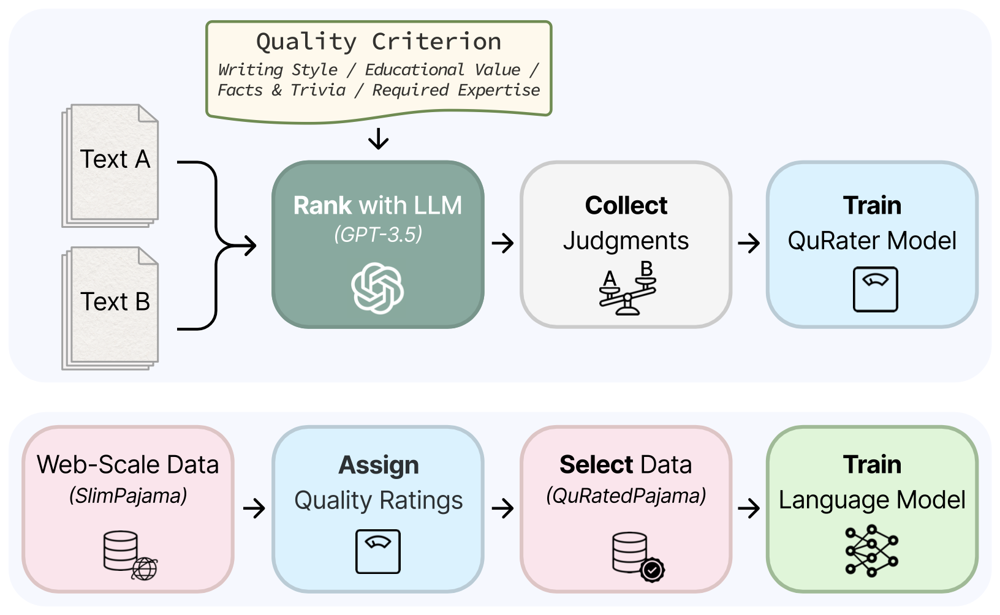

# QuRating: Selecting High-Quality Data for Training Language Models
*Documentation, models and data coming very soon...*

This is the official repository for the paper [QuRating: Selecting High-Quality Data for Training Language Models](https://arxiv.org/abs/2402.09739)
and contains code for (1) collecting LLM quality judgments (2) training QuRater models (3) selecting and sampling data (4) training LMs (5) reproducing the analysis in the paper *(in-progress)*.

 

 

## Models
**_‼️ The QuRater model fine-tuned from [ShearedLlama-1.3B](https://huggingface.co/princeton-nlp/Sheared-LLaMA-1.3B) can be found at [princeton-nlp/QuRater-1.3B](https://huggingface.co/princeton-nlp/QuRater-1.3B) on HuggingFace hub ‼️_**

#### Language Models
We train 1.3B language models on 30B tokens selected from 260B tokens using different data selection methods. All 30 models from our experiments can be found on HuggingFace hub:

* Baselines
  * Uniform Sampling: [princeton-nlp/lm-1.3B-select_30B_tokens_by-uniform-sampling](https://huggingface.co/princeton-nlp/lm-1.3B-select_30B_tokens_by-uniform-sampling)
  * DSIR
    * Target: Wikipedia (en): [princeton-nlp/lm-1.3B-select_30B_tokens_by-dsir_wikipedia_en](https://huggingface.co/princeton-nlp/lm-1.3B-select_30B_tokens_by-dsir_wikipedia_en)
    * Target: Book: [princeton-nlp/lm-1.3B-select_30B_tokens_by-dsir_book](https://huggingface.co/princeton-nlp/lm-1.3B-select_30B_tokens_by-dsir_book)
* Curriculum models - trained on the same dataset as the *Uniform Sampling* model, but we train on the samples in the order in which they are resampled using QuRating.
  * High-to-Low Required Expertise:   [princeton-nlp/lm-1.3B-select_30B_tokens_by-uniform-sampling-curriculum-high_to_low-required_expertise](https://huggingface.co/princeton-nlp/lm-1.3B-select_30B_tokens_by-uniform-sampling-curriculum-high_to_low-required_expertise)
  * Low-to-High Required Expertise:   [princeton-nlp/lm-1.3B-select_30B_tokens_by-uniform-sampling-curriculum-low_to_high-required_expertise](https://huggingface.co/princeton-nlp/lm-1.3B-select_30B_tokens_by-uniform-sampling-curriculum-low_to_high-required_expertise)
* QuRating models:
  | Quality Criterion     | Top-k Selection  | Sample with Temperature 1.0  | Sample with Temperature 2.0 |
  |:-------------------|:----------------------------------------------------------------------------------------------------------------------------------------------------------------------------------|:----------------------------------------------------------------------------------------------------------------------------------------------------------------------------------------------------------------------------|:----------------------------------------------------------------------------------------------------------------------------------------------------------------------------------------------------------------------------|
  | Writing Style      | [princeton-nlp/lm-1.3B-select_30B_tokens_by-writing_style-top_k](https://huggingface.co/princeton-nlp/lm-1.3B-select_30B_tokens_by-writing_style-top_k)           | [princeton-nlp/lm-1.3B-select_30B_tokens_by-writing_style-sample_with_temperature1.0](https://huggingface.co/princeton-nlp/lm-1.3B-select_30B_tokens_by-writing_style-sample_with_temperature1.0)           | [princeton-nlp/lm-1.3B-select_30B_tokens_by-writing_style-sample_with_temperature2.0](https://huggingface.co/princeton-nlp/lm-1.3B-select_30B_tokens_by-writing_style-sample_with_temperature2.0)           |
  | Facts & Trivia   | [princeton-nlp/lm-1.3B-select_30B_tokens_by-facts_and_trivia-top_k](https://huggingface.co/princeton-nlp/lm-1.3B-select_30B_tokens_by-facts_and_trivia-top_k)     | [princeton-nlp/lm-1.3B-select_30B_tokens_by-facts_and_trivia-sample_with_temperature1.0](https://huggingface.co/princeton-nlp/lm-1.3B-select_30B_tokens_by-facts_and_trivia-sample_with_temperature1.0)     | [princeton-nlp/lm-1.3B-select_30B_tokens_by-facts_and_trivia-sample_with_temperature2.0](https://huggingface.co/princeton-nlp/lm-1.3B-select_30B_tokens_by-facts_and_trivia-sample_with_temperature2.0)     |
  | Educational Value  | [princeton-nlp/lm-1.3B-select_30B_tokens_by-educational_value-top_k](https://huggingface.co/princeton-nlp/lm-1.3B-select_30B_tokens_by-educational_value-top_k)   | [princeton-nlp/lm-1.3B-select_30B_tokens_by-educational_value-sample_with_temperature1.0](https://huggingface.co/princeton-nlp/lm-1.3B-select_30B_tokens_by-educational_value-sample_with_temperature1.0)   | [princeton-nlp/lm-1.3B-select_30B_tokens_by-educational_value-sample_with_temperature2.0](https://huggingface.co/princeton-nlp/lm-1.3B-select_30B_tokens_by-educational_value-sample_with_temperature2.0)   |
  | Required Expertise | [princeton-nlp/lm-1.3B-select_30B_tokens_by-required_expertise-top_k](https://huggingface.co/princeton-nlp/lm-1.3B-select_30B_tokens_by-required_expertise-top_k) | [princeton-nlp/lm-1.3B-select_30B_tokens_by-required_expertise-sample_with_temperature1.0](https://huggingface.co/princeton-nlp/lm-1.3B-select_30B_tokens_by-required_expertise-sample_with_temperature1.0) | [princeton-nlp/lm-1.3B-select_30B_tokens_by-required_expertise-sample_with_temperature2.0](https://huggingface.co/princeton-nlp/lm-1.3B-select_30B_tokens_by-required_expertise-sample_with_temperature2.0) |
  | Mix of Criteria | - | - | [princeton-nlp/lm-1.3B-select_30B_tokens_by-mix_of_criteria-sample_with_temperature2.0](https://huggingface.co/princeton-nlp/lm-1.3B-select_30B_tokens_by-mix_of_criteria-sample_with_temperature2.0) |
  | Inverse Writing Style      | [princeton-nlp/lm-1.3B-select_30B_tokens_by-inverse_writing_style-top_k](https://huggingface.co/princeton-nlp/lm-1.3B-select_30B_tokens_by-inverse_writing_style-top_k)           | [princeton-nlp/lm-1.3B-select_30B_tokens_by-inverse_writing_style-sample_with_temperature1.0](https://huggingface.co/princeton-nlp/lm-1.3B-select_30B_tokens_by-inverse_writing_style-sample_with_temperature1.0)           | [princeton-nlp/lm-1.3B-select_30B_tokens_by-inverse_writing_style-sample_with_temperature2.0](https://huggingface.co/princeton-nlp/lm-1.3B-select_30B_tokens_by-inverse_writing_style-sample_with_temperature2.0)           |
  | Inverse Facts & Trivia   | [princeton-nlp/lm-1.3B-select_30B_tokens_by-inverse_facts_and_trivia-top_k](https://huggingface.co/princeton-nlp/lm-1.3B-select_30B_tokens_by-inverse_facts_and_trivia-top_k)     | [princeton-nlp/lm-1.3B-select_30B_tokens_by-inverse_facts_and_trivia-sample_with_temperature1.0](https://huggingface.co/princeton-nlp/lm-1.3B-select_30B_tokens_by-inverse_facts_and_trivia-sample_with_temperature1.0)     | [princeton-nlp/lm-1.3B-select_30B_tokens_by-inverse_facts_and_trivia-sample_with_temperature2.0](https://huggingface.co/princeton-nlp/lm-1.3B-select_30B_tokens_by-inverse_facts_and_trivia-sample_with_temperature2.0)     |
  | Inverse Educational Value  | [princeton-nlp/lm-1.3B-select_30B_tokens_by-inverse_educational_value-top_k](https://huggingface.co/princeton-nlp/lm-1.3B-select_30B_tokens_by-inverse_educational_value-top_k)   | [princeton-nlp/lm-1.3B-select_30B_tokens_by-inverse_educational_value-sample_with_temperature1.0](https://huggingface.co/princeton-nlp/lm-1.3B-select_30B_tokens_by-inverse_educational_value-sample_with_temperature1.0)   | [princeton-nlp/lm-1.3B-select_30B_tokens_by-inverse_educational_value-sample_with_temperature2.0](https://huggingface.co/princeton-nlp/lm-1.3B-select_30B_tokens_by-inverse_educational_value-sample_with_temperature2.0)   |
  | Inverse Required Expertise | [princeton-nlp/lm-1.3B-select_30B_tokens_by-inverse_required_expertise-top_k](https://huggingface.co/princeton-nlp/lm-1.3B-select_30B_tokens_by-inverse_required_expertise-top_k) | [princeton-nlp/lm-1.3B-select_30B_tokens_by-inverse_required_expertise-sample_with_temperature1.0](https://huggingface.co/princeton-nlp/lm-1.3B-select_30B_tokens_by-inverse_required_expertise-sample_with_temperature1.0) | [princeton-nlp/lm-1.3B-select_30B_tokens_by-inverse_required_expertise-sample_with_temperature2.0](https://huggingface.co/princeton-nlp/lm-1.3B-select_30B_tokens_by-inverse_required_expertise-sample_with_temperature2.0) |

